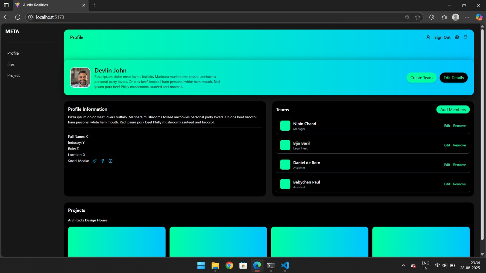
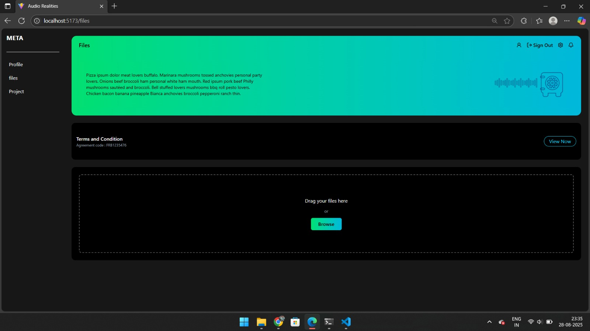

# Figma to React UI Conversion  

This project converts a given **Figma design** into a responsive and modular **React frontend**.  
Initially, the UI loads from **static mock data**, which will later be replaced with **backend REST API integration**.  

---

## Features  
- ✅ Accurate Figma-to-React conversion using **functional components & hooks**  
- ✅ **Static mock data** integration (`mockData.js`) for realistic content simulation  
- ✅ Scalable & modular project structure (components, pages, services)  
- ✅ **API integration ready** with a placeholder `dataService.js`  
- ✅ Responsive UI across devices (mobile, tablet, desktop)  
- ✅ Basic accessibility standards followed  

---

## Project Structure  

```bash
src/
 ├── components/      # Reusable UI components 
 ├── pages/           # Page-level components 
 ├── services/        # dataService.js (mock API / future backend calls)
 ├── data/            # mockData.js (temporary static data)
 ├── App.js           # Main app entry point
 └── index.js         # React entry point


### Profile Page  


### File Page 
